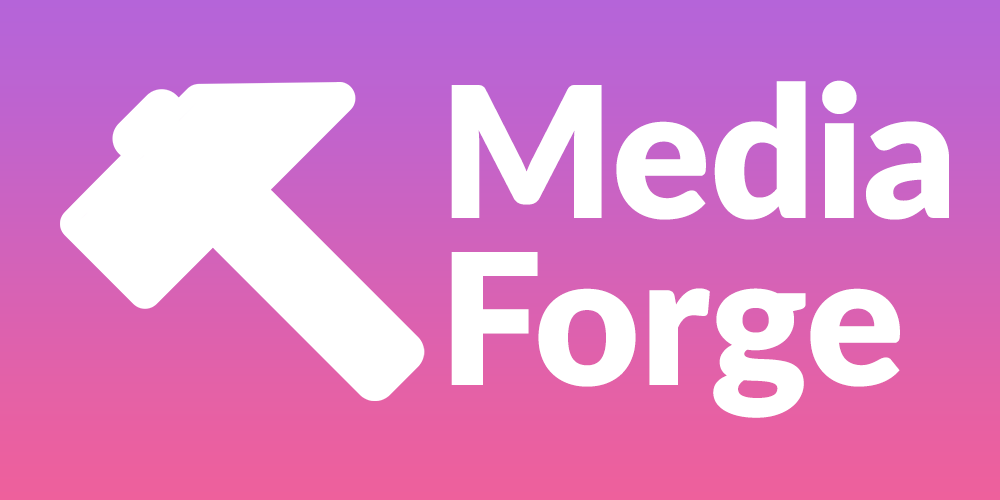

# 

[](https://discord.gg/xwWjgyVqBz)
[](https://top.gg/bot/780570413767983122)
[](https://top.gg/bot/780570413767983122)
[](https://top.gg/bot/780570413767983122/vote)
[](https://uptime.statuscake.com/?TestID=JyWrfGfIjT)


[](https://github.com/HexCodeFFF/mediaforge/stargazers)
[](https://knowyourmeme.com/memes/trollface)

[//]: # (![discord.py]&#40;https://img.shields.io/github/pipenv/locked/dependency-version/HexCodeFFF/mediaforge/nextcord&#41;)

[//]: # (![python]&#40;https://img.shields.io/github/pipenv/locked/python-version/HexCodeFFF/mediaforge&#41;)

[](https://ko-fi.com/Q5Q75US4A)

### A Discord bot for editing and creating videos, images, GIFs, and more!

## general technical info about the bot

- inspired by [esmBot](https://github.com/esmBot/esmBot)
- uses nextcord, a fork of discord.py
- uses FFmpeg for most media functions
- uses selenium and ChromeDriver to render captions in html with Chrome
    - although not the fastest approach, it is very simple and very powerful

## to self-host

### summary

ensure your OS is one of the [supported OSes](#supported-oses), then install the [python libraries](#python-libraries)
and the [non-python libraries](#non-python-libraries), set up the [config](#config), and [run](#to-run)

### supported OSes

built and tested on windows 10/11 and ubuntu 18/20, and these 2 OSes will continue to be officially supported.

will _probably_ work on macos and other linux/unix distros if the below libraries are available but theyre untested and
unsupported. just replace `apt-get` with your system's native package manager ([`brew`](https://brew.sh/) for macos)

### python libraries

- This project uses [`poetry`](https://python-poetry.org/), run `poetry install` to install the required dependencies.
    - install poetry with `pip install poetry`
    - [`aubio`](https://pypi.org/project/aubio/) and [`PyAutoTune`](https://github.com/ederwander/PyAutoTune) are built
      from source on installation.
        - on Windows this will require the MSVC compiler, which is an optional component
          of [Visual Studio](https://visualstudio.microsoft.com/downloads/)
        - on Linux this will require [`gcc`](https://packages.ubuntu.com/bionic/gcc), installable
          by `sudo apt-get install gcc`

### non-python libraries

the bot uses many external CLI programs for media processing.

- FFmpeg - not included but [easily installable on windows and linux](https://ffmpeg.org/download.html)
    - **If installing on ubuntu, ensure that ffmpeg version >= 4**
- gifski - windows executable is included. linux version [downloadable from the website](https://gif.ski/)
- pngquant - windows executable is included. installable on linux with `sudo apt-get install pngquant`
- ChromeDriver - ChromeDriver is automatically downloaded to match the chrome installation on your system when the bot
  starts.
    - if on linux, chrome must be in the system bin/path
    - if on windows, chrome must be in [one of the default locations](https://stackoverflow.com/a/40674915/9044183)
    - (specifically the win10 ones)
- ImageMagick - **not included** but [downloadable here](https://imagemagick.org/script/download.php)
- ExifTool - windows executable is included. installable on linux
  with `sudo apt-get install exiftool` https://exiftool.org/
- apngasm - windows executable is included. installable on linux with `sudo apt-get install apngasm`
- TTS
    - on linux, this uses [`espeak`](https://sourceforge.net/projects/espeak/files/espeak/)
      and [`mbrola`](https://github.com/numediart/MBROLA). Install
      with `sudo apt-get install espeak mbrola-us1 mbrola-us2`
    - on windows, [`powershell`](https://aka.ms/powershell) is used to
      access [Windows's native TTS](https://docs.microsoft.com/en-us/uwp/api/windows.media.speechsynthesis.speechsynthesizer)
      . Both are included in modern versions of Windows, but ensure powershell is in the system path.
    - the "retro" voice uses [Commodore SAM](https://github.com/vidarh/SAM). the windows and linux executable are
      included.

[//]: # (- glaxnimate - [downloadable on its website]&#40;https://glaxnimate.mattbas.org/download&#41;)

[//]: # (    - this library is not yet used. it is needed to render lottie stickers, but)

[//]: # (      [I am currently having issues installing the python bindings on windows.]&#40;https://gitlab.com/mattbas/glaxnimate/-/issues/398&#41;)

### config

- create a copy of [`config.example.py`](config.example.py) and name it `config.py`.
- insert/change the appropriate config settings such as your discord api token. be sure not to add or remove quotes.
- the 2 required config settings to change for proper functionality are the discord and tenor tokens.

### python

- developed and tested on python 3.8. use that or a later compatible version
- **python 3.10 is NOT compatible** (yet) 3.9 should work

### to run

- once you've set up all of the libraries, just run the program with `python main.py` (or `python3.8 main.py` or
  whatever your python is named). make sure it can read and write to the directory it lives in and also access/execute
  all the aforementioned libraries
    - if using pipenv, run `pipenv run python main.py` or open the venv shell with `pipenv shell` and then
      run `python main.py`
- terminate the bot by running the `shutdown` command, this will _probably_ close better than a termination

## !!experimental!! heroku-based hosting

1. [install heroku cli and log in](https://devcenter.heroku.com/articles/getting-started-with-python#set-up)
2. clone mediaforge onto your computer (`git clone https://github.com/HexCodeFFF/mediaforge`)
    - this will create a folder in the current directory
4. run `heroku create` in the newly created mediaforge directory to create a heroku app
5. add heroku buildpacks
    ```shell
    heroku buildpacks:add https://github.com/jonathanong/heroku-buildpack-ffmpeg-latest.git
    heroku buildpacks:add https://github.com/heroku/heroku-buildpack-google-chrome.git
    heroku buildpacks:add https://github.com/heroku/heroku-buildpack-chromedriver.git
    heroku buildpacks:add heroku-community/apt
    heroku buildpacks:add heroku/python
    ```
4. add [Heroku Postgres addon](https://elements.heroku.com/addons/heroku-postgresql)
5. set up bot config
    - [create a local config file](#config)
        - don't worry about `chrome_driver_linux`, this option is ignored in heroku production.
    - encode the file as base64
        - on linux:
            - `base64 config.py` prints the output to terminal
            - `base64 config.py > config.txt` writes the output to config.txt
        - with python:
            ```python
            import base64
            with open("config.py", "rb") as f:
                out = base64.b64encode(f.read())
            print(out)  # write to terminal
            # write to file
            with open("config.txt", "wb+") as f:
                f.write(out)
            ```
    - save file as config option (replace `<BASE64OUTPUT>` with the output from earlier.)
        ```shell
        heroku config:set PRIVATEFILE_config.py=<BASE64OUTPUT>
        ```
        - note: if you want other private files deployed to heroku, do the same steps but replace `config.py`
          in `PRIVATEFILE_config.py` with the filename.
6. start app
    ```shell
    heroku ps:scale worker=1
    ```

**NOTE:** currently, guild-specific prefixes wont persist after a re-deployment. heroku files are temporary and i
haven't YET written the code to interface with their databases.
